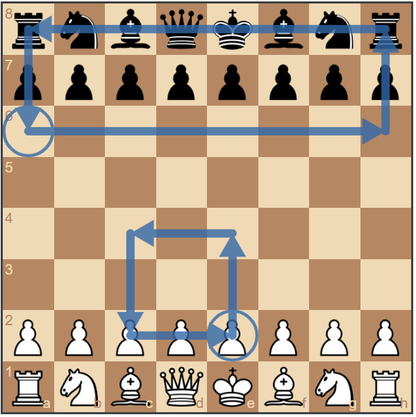

# chessboard-arrows
A library that extends any chessboard library to allow users to draw arrows and circles. The following setup will use [chessboard.js](https://github.com/oakmac/chessboardjs) for demonstration.



Right-click to draw arrows and circles, left-click to clear the drawings.

## Setup

An example `index.html` is shown below to setup a project. It imports the javascript and stylesheet files for chessboard-arrows and chessboard.js. The initial board size is set to `400px`, with the canvas size 8 pixels less than this.

```html
<html>
    <head>
        <script src="https://cdnjs.cloudflare.com/ajax/libs/chess.js/0.10.2/chess.js"></script>
        <script src="https://code.jquery.com/jquery-3.4.1.min.js"></script>
        <link rel="stylesheet" href="https://unpkg.com/@chrisoakman/chessboardjs@1.0.0/dist/chessboard-1.0.0.min.css">
        <script src="https://unpkg.com/@chrisoakman/chessboardjs@1.0.0/dist/chessboard-1.0.0.min.js"></script>
        <link rel="stylesheet" src="chessboard-arrows.js" href="chessboard-arrows.css">
        <script src="chessboard-arrows.js"></script>
    </head>
    <body>
        <div id="board_wrapper">
            <canvas id="primary_canvas" width="392" height="392" ></canvas>
            <canvas id="drawing_canvas"  width="392" height="392" ></canvas>
            <div id="board" style="width: 400px; height: 400px;"></div>
        </div>
    </body>
    <script>
        var board = Chessboard('board', 'start');
        ChessboardArrows();
    </script>
</html>
```
## Options
chessboard-arrows is initialised by `ChessboardArrows(id[, resFactor, colour])`, where the following parameters are given as arguments:
  * `id`: the board wrapper ID.
  * `resFactor`: the ratio of the canvas size and board size. Increase this to get a higher DPI.
  * `colour`: the colour of the arrows and circles.
